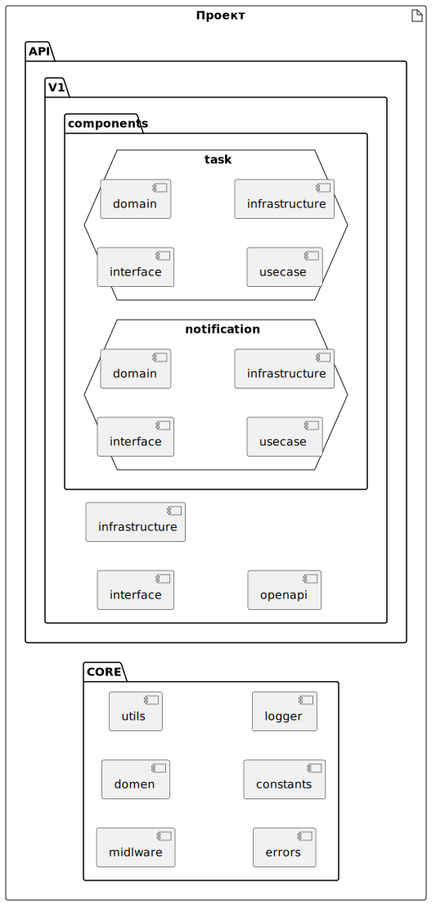

# rest-nodejs-cleanarch-template

Шаблон REST API сервера на компонентной чистой архитектуре

        

## Описание проекта

Проект представляет собой полный шаблон REST API сервиса, построенный на компонентной чистой архитектуре (бабл-архитектура).

В проекте применяются: миграции БД, версионность API, Docker, Kafka, OpenAPI.

В основе проекта лежат принципы чистой (луковой) архитектуры, с такими элементами как: домен, usecase, интерфейс, инфраструктура и доменные события.
Спецификой проекта является добавление компонентной части, которая представляет собой набор необходимых бизнес-объектов. 
Компоненты, в свою очередь, реализованы на чистой архитектуре.
Взаимодействие между компнентами реализовано средствами доменных событий родительского домена.

## Диаграмма проекта

<!--
@startuml projectdiagram
left to right direction
artifact Проект { 
''component "CORE API" {
    artifact core { 
        hexagon "API V1" {
            component "interface"
            component "infrastructure"
        }
    }
    component components {
        hexagon "task" {
            component "interface" as intr1
            component "infrastructure" as infr1
        }
        hexagon notification {
            component "interface" as intr2
            component "infrastructure" as infr2
        }
    }
''}
}
@enduml
-->



## Структура проекта

```

├───api
│   └───v1
│       ├───components
│       │       ├───notification
│       │       │        ├───domain
│       │       │        ├───services
│       │       │        ├───subscribers
│       │       │        └───usecases
│       │       └───tasks
│       │                ├───domain
│       │                │       ├───datasources
│       │                │       ├───entities
│       │                │       ├───events
│       │                │       ├───repositories
│       │                │       ├───types
│       │                │       └───valueobjects
│       │                ├───infrastructure
│       │                ├───interface
│       │                └───usecases
│       ├───infrastructure
│       │       ├───oracle
│       │       └───postgresql
│       ├───interface
│       └───openapi
├───config
└───core
        ├───constants
        ├───domain
        │       ├───events
        │       └───types
        ├───errors
        ├───logger
        ├───middlewares
        │       ├───auth
        │       └───errors
        ├───subscribers
        └───utils
```

### Описание каталогов проекта

#### core

Каталог **core** содержит общие для всего проекта компоненты. Такие как: аутентификация, доменнные события, константы, интерфейсы, типы, ошибки, хелперы и т.д.

#### api

Каталог **api** разбит по версиям, где каждая версия содержит интерфейсы (роуты), инфраструктуру (в частном случае работу с БД) и компоненты системы. Компоненты системы, в свою очередь, представляют собой проекты чистой архитектуры. Каждый компонент может содержать каталоги: domain, usecases, infrastructure, interface, subscribers.

#### config

Каталог **config** содержит вспомогательные компоненты для работы с конфигурациями.

## МИГРАЦИИ БД

### 1. PostgreSql
#### db-migrate
ссылки: 
[https://db-migrate.readthedocs.io/en/latest/](https://db-migrate.readthedocs.io/en/latest/)
[https://coding-overhead.com/post/db-migrate](https://coding-overhead.com/post/db-migrate)
#### Создание миграции (для Windows выполнить в Git bash)
    node_modules/.bin/db-migrate create v0_0_1 --config ./src/core/config/database.json --sql-file
#### Создание БД
    node_modules/.bin/db-migrate db:create test --config ./src/core/config/database.json
#### Откат БД
    node_modules/.bin/db-migrate down --config ./src/core/config/database.json
#### Новая миграция
    node_modules/.bin/db-migrate up --config ./src/core/config/database.json

### 2. Oracle DB
#### Пакет Marv
ссылки:
[https://github.com/guidesmiths/marv/](https://github.com/guidesmiths/marv/)
[https://www.npmjs.com/package/marv](https://www.npmjs.com/package/marv)
[https://www.npmjs.com/package/marv-oracledb-driver](https://www.npmjs.com/package/marv-oracledb-driver)

#### Создание миграции
1. В папке /migrations создаем файл .sql
2. Номерацию файла продолжаем или начинаем с 001

#### Запуск миграции
Команда запуска миграции

    npm run oraclemigration

## ТЕСТЫ
Команда запуска тестов

    npm run test

## ЗАПУСК
### В докере
Забираем последнюю версию

    sudo git pull

Запуск докера

    sudo bash service_up.sh

Остановка докера

    sudo bash service_down.sh

### Сборка проекта

    npm run build

### Запуск debug 

    npm run dev

### Запуск production

    npm run serve
