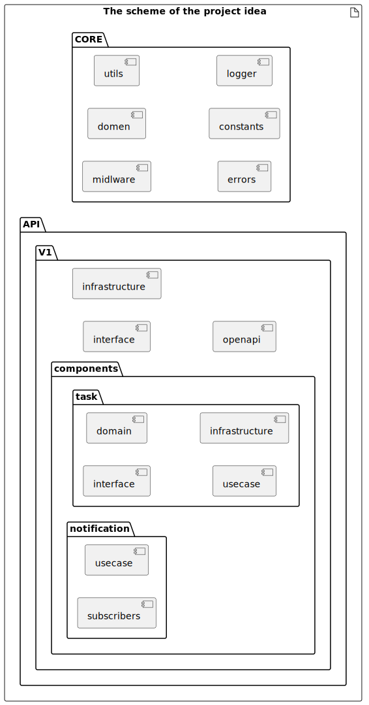

# rest-nodejs-cleanarch-template [[English version]](https://github.com/KravetsMikhail/rest-nodejs-cleanarch-template/blob/main/README-en.md)

Шаблон REST API сервера на компонентной чистой архитектуре

        

## Описание проекта

Проект представляет собой шаблон REST API сервиса, построенный на компонентной чистой архитектуре для реализации DDD (Domain Driven Design).

В проекте применяются: миграции БД, версионность API, Docker, Kafka, OpenAPI (Swagger), swagger-jsdoc.

В основе проекта лежат принципы чистой (луковой) архитектуры, с такими элементами как: домен, usecase, интерфейс, инфраструктура и доменные события.  
Спецификой проекта является добавление компонентной части, которая представляет собой набор необходимых бизнес-объектов. Компоненты, в свою очередь, реализованы на чистой архитектуре. Взаимодействие между компнентами осуществляется доменными событиями core/domain/events.

Применены паттерны: Repository, Domain Events, Circuit Breaker и др.

### Circuit Breaker

В проекте реализован паттерн Circuit Breaker для защиты от каскадных сбоев при работе с внешними сервисами и базами данных. Circuit Breaker автоматически разрывает соединение при достижении порогового количества ошибок и периодически проверяет доступность сервиса.

**Настройки Circuit Breaker:**
- `CIRCUIT_BREAKER_FAILURE_THRESHOLD` - порог сбоев (по умолчанию: 3)
- `CIRCUIT_BREAKER_RESET_TIMEOUT` - таймаут восстановления (по умолчанию: 10000мс)

Тестирование выполняется с применением фреймворка Jest.

## Ключевые возможности

- ✅ **Чистая архитектура** - Component-based DDD подход
- ✅ **Автоматическая генерация компонентов** - Component Generator
- ✅ **Swagger документация** - swagger-jsdoc интеграция
- ✅ **Мульти-база данных** - PostgreSQL и Oracle
- ✅ **Событийная архитектура** - Domain Events с Kafka
- ✅ **Circuit Breaker** - Защита от каскадных сбоев
- ✅ **Версионирование API** - Поддержка нескольких версий
- ✅ **TypeScript** - Полная типобезопасность
- ✅ **Тестирование** - Jest фреймворк
- ✅ **Docker** - Контейнеризация

## Требования

- **Node.js** 18.x или выше
- **npm** 8.x или выше
- **Go** 1.19 или выше (для Component Generator)
- **Docker** и **Docker Compose**
- **PostgreSQL** или **Oracle** база данных

## Быстрый старт

### 1. Клонирование и установка

```bash
git clone https://github.com/KravetsMikhail/rest-nodejs-cleanarch-template.git
cd rest-nodejs-cleanarch-template
npm install
```

### 2. Настройка окружения

```bash
cp .env.example .env
# Отредактируйте .env файл с вашими настройками
```

### 3. Сборка генератора компонентов

```bash
cd src/utils/component-generator
go build -o component-generator.exe
```

### 4. Запуск проекта

```bash
# Разработка
npm run dev

# Production
npm run build
npm run serve
```

### 5. Доступ к документации

- **Swagger UI**: `http://localhost:1234/api-docs`
- **Health Check**: `http://localhost:1234/health`
- **Примеры использования**: [EXAMPLES.md](./EXAMPLES.md)
- **English Examples**: [EXAMPLES-en.md](./EXAMPLES-en.md)

## Схема проекта

<!--
@startuml projectdiagram
left to right direction
artifact "Проект" {
    folder "API" { 
        folder "V1" {
            component "interface"
            folder "components" {
                hexagon "task" {
                    component "interface" as intr1
                    component "domain" as domain1
                    component "usecase" as usecase1
                    component "infrastructure" as infr1
                }
                hexagon "notification" {                    
                    component "usecase" as usecase2
                    component "subscribers" as subscribers2
                }
            }
            component "infrastructure"
            component "openapi"
        }
    }
    folder "CORE" {
        component "midlware"
        component "domen"
        component "utils"
        component "errors"
        component "constants"
        component "logger"
    }
}
@enduml
-->



## Структура проекта

```txt
├───api
│   └───v1
│       ├───components
│       │       ├───notification
│       │       │        ├───subscribers
│       │       │        └───usecases
│       │       └───tasks
│       │                ├───domain
│       │                │       ├───datasources
│       │                │       ├───entities
│       │                │       ├───events
│       │                │       ├───repositories
│       │                │       ├───types
│       │                │       └───valueobjects
│       │                ├───infrastructure
│       │                ├───interface
│       │                └───usecases
│       ├───infrastructure
|       |       ├───kafka 
│       │       ├───oracle
│       │       └───postgresql
│       ├───interface
│       └───openapi
├───config
└───core
        ├───constants
        ├───domain
        │       ├───events
        │       └───types
        ├───errors
        ├───logger
        ├───middlewares
        │       ├───auth
        │       └───errors
        ├───subscribers
        └───utils
```

### Описание каталогов проекта

#### core

Каталог **core** содержит общие для всего проекта компоненты. Такие как: аутентификация, доменнные события, константы, интерфейсы, типы, ошибки, хелперы и т.д.

#### api

Каталог **api** разбит по версиям, где каждая версия содержит интерфейсы (роуты), инфраструктуру (в частном случае работу с БД) и компоненты системы. Компоненты системы, в свою очередь, представляют собой проекты чистой архитектуры. Каждый компонент может содержать каталоги: domain, usecases, infrastructure, interface, subscribers.

#### config

Каталог **config** содержит вспомогательные компоненты для работы с конфигурациями.

#### .env

Файл **.env** содержит переменные окружения, которые используются в проекте. Все переменные окружения описаны в файле **.env.example**.

### События

В проекте реализована поддержка доменных событий. Для работы с событиями необходимо использовать интерфейсы и компоненты из **core\domain\events**.

Для отправки событий внешним сервисам необходимо в **api/v1/infrastructure** реализовать соответствующий сервис. В проекте используется брокер сообщений Kafka.

## Как запустить проект

### Запуск в докере

Для проверки и тестирования, необходимо  запустить докеры следующих проектов (см. readme каждого проекта):

1. Проект аутентификации [rest-nodejs-cleanarch-template-auth](https://github.com/KravetsMikhail/rest-nodejs-cleanarch-template-auth). Реализован на [keycloak](https://github.com/keycloak/keycloak).

    ```bash
    git clone https://github.com/KravetsMikhail/rest-nodejs-cleanarch-template-auth.git
    ```

    ```bash
    cd rest-nodejs-cleanarch-template-auth
    ```

    В корневую папку добавляем файл .env (см.  пример в .env.example)

    Запускаем докеры:

    ```bash
    docker compose up
    ```

    Затем:
    - перейти в интерфейс Keycloack <http://localhost:8282>
    - задать логин и пароль администратора, например admin | admin
    - выбрать Realm: rest-nodejs-cleanarch-template
    - добавить пользователя, например user1. Во вкладке Creditials создать пароль пользователя.

2. Проект шаблона ядра на чистой архитектуре [rest-nodejs-cleanarch-template](https://github.com/KravetsMikhail/rest-nodejs-cleanarch-template.git)

    ```bash
    git clone https://github.com/KravetsMikhail/rest-nodejs-cleanarch-template.git
    ```

    ```bash
    cd rest-nodejs-cleanarch-template
    ```

    В корневую папку добавляем файл .env.production.local (см. пример в .env.example)

    Запускаем докеры:

    ```bash
    docker compose up
    ```

    Создаем БД (детальное описание смотри ниже):

    ```bash
    node_modules/.bin/db-migrate db:create test --config ./src/config/database.json
    ```

    Запускаем миграции:

    ```bash
    node_modules/.bin/db-migrate up --config ./src/config/database.json
    ```

3. Проект UI [rest-nodejs-cleanarch-template-ui](https://github.com/KravetsMikhail/rest-nodejs-cleanarch-template-ui). Реализован на REACT, фреймворк [Refine](https://github.com/refinedev/refine)

    ```bash
    git clone https://github.com/KravetsMikhail/rest-nodejs-cleanarch-template-ui.git
    ```

    ```bash
    cd rest-nodejs-cleanarch-template-ui
    ```

    В корневую папку добавляем файл .env.production.local (см. пример в .env.example)

    Запускаем докеры:

    ```bash
    docker compose up
    ```

## OpenAPI и Swagger

Проект использует два подхода для документации API:

### 1. Swagger JSDoc (Рекомендуемый подход)

Автоматическая генерация документации из JSDoc комментариев в коде:

- **Swagger UI**: `http://localhost:1234/api-docs`
- **JSON спецификация**: `http://localhost:1234/api-docs.json`
- **Автоматическая генерация**: Из комментариев в контроллерах
- **Component Generator**: Создает контроллеры с готовыми аннотациями

### 2. OpenAPI YAML

Традиционный подход с YAML файлами:

- **Расположение**: `src/api/v1/openapi/openapi.yaml`
- **Доступ**: `http://localhost:1234/api-docs/v1/`
- **Ручное редактирование**: При необходимости

### Пример JSDoc аннотаций

```typescript
/**
 * @swagger
 * tags:
 *   name: tasks
 *   description: Operations with tasks
 */
export class TaskController {
    /**
     * @swagger
     * /tasks:
     *   get:
     *     summary: Get list of tasks
     *     tags: [tasks]
     *     security:
     *       - JWT: [read]
     *     responses:
     *       200:
     *         description: List of tasks
     */
    public getTasks = (req: Request, res: Response): void => {
        // Implementation
    }
}
```

### Запросы к API

Запросы к API можно выполнять с помощью Postman или с помощью curl.

Адрес сервера: `http://localhost:1234/api/v1/`

## ИНСТРУМЕНТЫ РАЗРАБОТКИ

### Component Generator

В проект включен консольный генератор компонентов на Go, который автоматически создает структуру для новых API компонентов по паттерну Clean Architecture.

**Расположение:** `src/utils/component-generator/`

**Основные возможности:**
- Автоматическая генерация полной структуры компонента (entities, value objects, events, repositories, controllers, use cases)
- Поддержка генерации полей из SQL миграций
- Автоматическая генерация OpenAPI документации
- Следование паттерну Clean Architecture
- Автоматическое создание декораторов `@DbType` для ORM

**Использование:**
```bash
cd src/utils/component-generator

# Базовая генерация компонента
./component-generator.exe generate --singular product --plural products --version v1

# Генерация с полями из SQL миграции
./component-generator.exe generate --singular product --plural products --migration ../../../migrations/001_create_products.sql
```

**Поддерживаемые SQL типы:**
- `INTEGER/INT/SERIAL` → `number`
- `VARCHAR/TEXT/CHAR` → `string`
- `BOOLEAN/BOOL` → `boolean`
- `DATE/TIMESTAMP` → `Date`
- `DECIMAL/NUMERIC/FLOAT/DOUBLE` → `number`

**Сгенерированная структура:**
```
src/api/v1/components/{plural}/
├── domain/
│   ├── entities/           # Entity классы
│   ├── valueobjects/        # Value Objects
│   ├── events/             # Доменные события
│   ├── repositories/        # Интерфейсы репозиториев
│   ├── datasources/         # Интерфейсы источников данных
│   └── types/               # Типы ответов
├── infrastructure/           # Реализации источников данных
├── interface/                # Контроллеры и маршруты
└── usecases/                 # Use cases
```

**Документация:** 
- Подробное описание: `docs/component-generator.md`
- Практические примеры: [EXAMPLES.md](./EXAMPLES.md#создание-нового-компонента)

### Swagger JSDoc Integration

Для автоматической генерации документации API используется swagger-jsdoc:

**Установка:**
```bash
npm install swagger-jsdoc @types/swagger-jsdoc
```

**Конфигурация:**
- Файл конфигурации: `src/config/swagger.ts`
- Интеграция с сервером: `src/server.ts`
- Автоматическая обработка JSDoc комментариев

**Использование:**
1. Добавьте JSDoc аннотации в контроллеры
2. Component Generator автоматически создает аннотации
3. Документация доступна по адресу: `http://localhost:1234/api-docs`

**Документация:** 
- Подробное описание: `docs/swagger-integration.md`
- Практические примеры: [EXAMPLES.md](./EXAMPLES.md#интеграция-с-swagger)

## МИГРАЦИИ БД

### 1. PostgreSql

#### db-migrate

ссылки:

[https://db-migrate.readthedocs.io/en/latest/](https://db-migrate.readthedocs.io/en/latest/)
[https://coding-overhead.com/post/db-migrate](https://coding-overhead.com/post/db-migrate)

#### Создание миграции (для Windows выполнить в Git bash)

```bash
    node_modules/.bin/db-migrate create v0_0_1 --config ./src/config/database.json --sql-file
```

#### Создание БД

```bash
    node_modules/.bin/db-migrate db:create test --config ./src/config/database.json
```

#### Откат БД

```bash
    node_modules/.bin/db-migrate down --config ./src/config/database.json
```

#### Новая миграция

```bash
    node_modules/.bin/db-migrate up --config ./src/config/database.json
```

### 2. Oracle DB

#### Пакет Marv

ссылки:

[https://github.com/guidesmiths/marv/](https://github.com/guidesmiths/marv/)
[https://www.npmjs.com/package/marv](https://www.npmjs.com/package/marv)
[https://www.npmjs.com/package/marv-oracledb-driver](https://www.npmjs.com/package/marv-oracledb-driver)

#### Создание миграции

1. В папке /migrations создаем файл .sql
2. Номерацию файла продолжаем или начинаем с 001

#### Запуск миграции

Команда запуска миграции

```bash
    npm run oraclemigration
```

## НАГРУЗОЧНОЕ ТЕСТИРОВАНИЕ

Проект включает в себя готовые конфигурации для нагрузочного тестирования с использованием Artillery. Нагрузочное тестирование позволяет оценить производительность сервера под различными уровнями нагрузки и определить его пропускную способность.

### Подготовка к тестированию

#### 1. Установка Artillery

```bash
npm install -g artillery
```

#### 2. Запуск сервера

Убедитесь, что сервер запущен и доступен по адресу `http://localhost:1234`:

```bash
npm run dev
```

#### 3. Проверка доступности

```bash
curl http://localhost:1234/health
```

### Конфигурации тестов

В проекте подготовлены две основные конфигурации:

#### 1. Тест без аутентификации (`load-test-no-auth.yml`)

Тестирует базовые эндпоинты без JWT аутентификации:
- Health check: `/health`
- Root endpoint: `/`
- Swagger docs: `/api-docs`

#### 2. Тест с JWT аутентификацией (`load-test-with-auth.yml`)

Тестирует защищенные эндпоинты с JWT токенами:
- Все эндпоинты из первого теста
- API endpoints: `/api/v1/tasks`
- Автоматическое получение и использование JWT токенов

### Запуск нагрузочного тестирования

#### Базовый тест (без аутентификации)

```bash
npx artillery run load-test-no-auth.yml
```

#### Расширенный тест (с JWT аутентификацией)

```bash
npx artillery run load-test-with-auth.yml
```

#### Запуск в фоновом режиме

```bash
npx artillery run load-test-no-auth.yml &
```

### Фазы нагрузочного тестирования

Тестирование включает следующие фазы:

1. **Warm Up (60 сек)** - Разогрев сервера при 50 RPS
2. **Ramp Up (60 сек)** - Постепенное увеличение до 100 RPS
3. **Sustained Load (180 сек)** - Стабильная нагрузка 200 RPS
4. **Peak Load (60 сек)** - Пиковая нагрузка 500 RPS
5. **Stress Test (120 сек)** - Стрессовая нагрузка 1000 RPS
6. **Load to Failure (300 сек)** - Нагрузка до отказа 2000+ RPS

### Анализ результатов

#### Ключевые метрики

- **Request Rate**: Количество запросов в секунду
- **Response Time**: Время ответа (min, max, mean, median, p95, p99)
- **Error Rate**: Процент ошибок
- **Throughput**: Общая пропускная способность

#### Оптимальные показатели для данного проекта

- **Стабильная нагрузка**: 100-200 RPS
- **Максимальная стабильная**: 300 RPS  
- **Пиковая**: до 500 RPS
- **Критическая**: > 500 RPS (начинается деградация)

#### Пример результатов тестирования

```
All VUs finished. Total time: 18 minutes, 35 seconds

Summary report:
http.request_rate: 279/sec
http.requests: 757061
http.response_time:
  min: 0
  mean: 770.8ms
  median: 5ms
  p95: 3328.3ms
  p99: 4231.1ms
vusers.completed: 75119
vusers.failed: 669150
```

### Рекомендации по оптимизации

#### Настройки сервера для высокой нагрузки

1. **Rate Limiting**: Увеличить лимиты в `src/core/middlewares/rate-limiter.middleware.ts`
2. **Connection Pool**: Оптимизировать в `src/api/v1/infrastructure/postgresql.datasource.ts`
3. **JWT Cache**: Настроить кэширование токенов
4. **Circuit Breaker**: Настроить пороги срабатывания

#### Environment переменные для производительности

```bash
# Rate limiting
RATE_LIMIT_WINDOW_MS=900000
RATE_LIMIT_MAX_REQUESTS=50000

# PostgreSQL
PG_POOL_MAX=100
PG_POOL_MIN=10
PG_POOL_IDLE_TIMEOUTMillis=30000

# Circuit Breaker
CIRCUIT_BREAKER_FAILURE_THRESHOLD=10
CIRCUIT_BREAKER_RESET_TIMEOUT=30000
```

### Мониторинг во время тестирования

#### Системные метрики

```bash
# CPU и память
htop

# Сетевые соединения
netstat -an | grep :1234

# Логи сервера
tail -f logs/app.log
```

#### Метрики приложения

- Health check endpoint: `/health`
- Swagger docs: `/api-docs`
- Application logs в реальном времени

### Создание собственных тестов

#### Пример кастомной конфигурации

```yaml
config:
  target: 'http://localhost:1234'
  phases:
    - duration: 60
      arrivalRate: 10
    - duration: 120
      arrivalRate: 50

scenarios:
  - name: "Custom API Test"
    requests:
      - get:
          url: "/api/v1/tasks"
          headers:
            Authorization: "Bearer {{ token }}"
```

#### Запуск кастомного теста

```bash
artillery run custom-test.yml
```

### Устранение проблем

#### Распространенные ошибки

1. **ECONNREFUSED** - Сервер не запущен или порт занят
2. **ETIMEDOUT** - Сервер перегружен, увеличьте таймауты
3. **Memory leaks** - Проверьте утечки памяти при длительных тестах

#### Решения

```bash
# Освобождение порта
netstat -ano | findstr :1234
taskkill /PID <PID> /F

# Проверка памяти
node --inspect src/server.ts
```

### Документация Artillery

- [Официальная документация](https://artillery.io/docs/)
- [Примеры конфигураций](https://artillery.io/docs/guides/getting-started/writing-your-first-test.html)

## ТЕСТЫ

Команда запуска тестов

```bash
    npm run test
```

## ЗАПУСК

### В докере

Забираем последнюю версию

```bash
    sudo git pull
```

#### Запуск докера

Linux

```bash
    sudo bash service_up.sh
```

Windows (в Git bash)

```bash
    bash service_up.sh
```

#### Остановка докера

Linux

```bash
    sudo bash service_down.sh
```

Windows (в Git bash)

```bash
    bash service_down.sh
```

### Сборка проекта

```bash
    npm run build
```

### Запуск debug

```bash
    npm run dev
```

### Запуск production

```bash
    npm run serve
```

### Ссылки

В разработке шаблона использовались наработки: [@tkssharma](https://github.com/tkssharma#hey-im-tarun-tkssharma), [@stemmlerjs](https://github.com/stemmlerjs/white-label)
